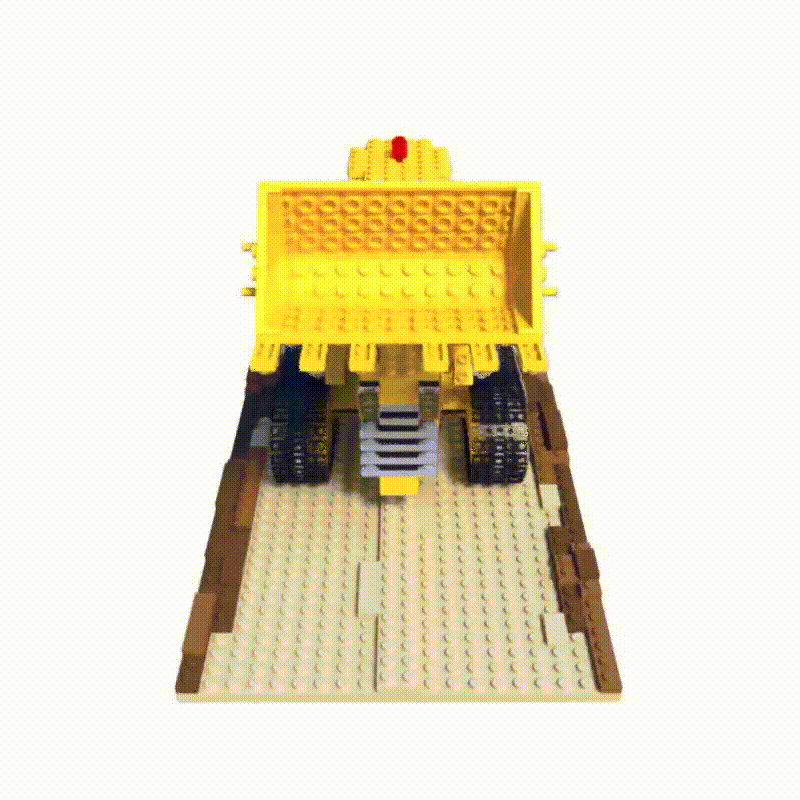

<div align=center>
  <h1>
    NeRF: 3D Reconstruction from 2D Images
  </h1>
  <p>
    <a href=https://mhsung.github.io/kaist-cs479-spring-2026/ target="_blank"><b>KAIST CS479: Machine Learning for 3D Data (2026 Spring)</b></a><br>
    Programming Assignment 2    
  </p>
</div>

<div align=center>
  <p>
    Instructor: <a href=https://mhsung.github.io target="_blank"><b>Minhyuk Sung</b></a> (mhsung [at] kaist.ac.kr)<br>
    TA: <a href=https://32V.github.io target="_blank"><b>Kyeongmin Yeo</b></a>  (aaaaa [at] kaist.ac.kr)<br>
    Credit: <a href=https://dvelopery0115.github.io target="_blank"><b>Seungwoo Yoo</b></a> (dreamy1534 [at] kaist.ac.kr)
  </p>
</div>

<div align=center>
  
</div>

#### Due: April 28, 2026 (Tuesday) 23:59 KST
#### Where to Submit: KLMS

## Abstract

The introduction of [Neural Radiance Fields (NeRF)](https://arxiv.org/abs/2003.08934) was a massive milestone in image-based, neural rendering literature.
Compared with previous works on novel view synthesis, NeRF is a simple, yet powerful idea that combines recently emerging neural implicit representations with traditional volume rendering techniques.
As of today, the follow-up research aiming to scale and extend the idea to various tasks has become one of the most significant streams in the computer vision community thanks to its simplicity and versatility.

In this assignment, we will take a technical deep dive into NeRF to understand this ground-breaking approach which will help us navigate a broader landscape of the field.
We strongly recommend you check out the paper, together with [our brief summary](https://www.notion.so/geometry-kaist/Tutorial-2-NeRF-Neural-Radiance-Field-ef0c1f3446434162a540e6afc7aeccc8?pvs=4), before, or while working on this assignment.

<details>
<summary><b>Table of Content</b></summary>
  
- [Abstract](#abstract)
- [Setup](#setup)
- [Code Structure](#code-structure)
- [Tasks](#tasks)
  - [Task 0. Environment Setup](#task-0-environment-setup)
  - [Task 1. Implementing Ray Sampling](#task-1-implementing-ray-sampling)
  - [Task 2. Implementing Volume Rendering Equation](#task-2-implementing-volume-rendering-equation)
  - [Task 3. Qualitative \& Quantitative Evaluation](#task-3-qualitative--quantitative-evaluation)
  - [(Optional) Task 4. Train NeRF with Your Own Data](#optional-task-4-train-nerf-with-your-own-data)
- [What to Submit](#what-to-submit)
- [Grading](#grading)
- [Further Readings](#further-readings)
</details>

## Setup

We provide a Jupyter notebook (`NeRF_Inference.ipynb`) for running the entire pipeline, from environment setup to rendering, evaluation, and submission packaging.

Open the notebook in Kcloud server and follow the step-by-step instructions. The repository already includes the `lego` dataset and a pre-trained checkpoint (`lego_ckpt.pth`). The notebook will:
1. Verify GPU availability and install dependencies
2. Run rendering with the provided checkpoint
3. Compute evaluation metrics (LPIPS, PSNR)
4. Package your submission as a ZIP file

## Code Structure
This codebase is organized as the following directory tree. We only list the core components for brevity:
```
torch_nerf
│
├── configs             <- Directory containing config files
│
├── runners
│   ├── evaluate.py     <- Script for quantitative evaluation.
│   ├── render.py       <- Script for rendering (i.e., qualitative evaluation).
│   ├── train.py        <- Script for training.
│   └── utils.py        <- A collection of utilities used in the scripts above.
│
├── src
│   ├── cameras
│   │   ├── cameras.py
│   │   └── rays.py
│   │   
│   ├── network
│   │   └── nerf.py
│   │
│   ├── renderer
│   │   ├── integrators
│   │   ├── ray_samplers
│   │   └── volume_renderer.py
│   │
│   ├── scene
│   │
│   ├── signal_encoder
│   │   ├── positional_encoder.py
│   │   └── signal_encoder_base.py
│   │
│   └── utils
│       ├── data
│       │   ├── blender_dataset.py
│       │   └── load_blender.py
│       │
│       └── metrics
│           └── rgb_metrics.py
│
├── requirements.txt    <- Dependency configuration file.
└── README.md           <- This file.
```

## Tasks

### Task 0. Environment Setup

Clone this repository to your KCloud server and open `NeRF_Inference.ipynb` in your code editor (we recommend VSCode). The notebook guides you through the entire workflow.

1. **GPU Check**: Verify that a GPU is available.
2. **Install Dependencies**: Run `pip install -q -r requirements.txt` to install the packages including Pytorch.


### Task 1. Implementing Ray Sampling
```bash
#! files-to-modify
$ torch_nerf/src/cameras/rays.py
$ torch_nerf/src/renderer/ray_samplers/stratified_sampler.py
```
This task consists of two sub-tasks:

1. Implement the body of function `compute_sample_coordinates` in `torch_nerf/src/cameras/rays.py`.
This function will be used to evaluate the coordinates of points along rays cast from image pixels.
For a ray $r$ parameterized by the origin $\mathbf{o}$ and direction $\mathbf{d}$ (not necessarily a unit vector), a point on the ray can be computed by

```math
r(t) = \mathbf{o} + t \mathbf{d},
```
where $t \in [t_n, t_f]$ is bounded by the near bound $t_n$ and the far bound $t_f$, respectively.

2. Implement the body of function `sample_along_rays_uniform` in `torch_nerf/src/renderer/ray_samplers/stratified_sampler.py`.
The function implements the stratified sampling illustrated in the following equation (Eqn 2. in the paper).

```math
t_i \sim \mathcal{U} \left[ t_n + \frac{i-1}{N} \left( t_f - t_n \right), t_n + \frac{i}{N} \left( t_f - t_n \right) \right].
```

> :bulb: Check out the helper functions [`create_t_bins`](https://github.com/KAIST-Visual-AI-Group/CS479-Assignment-NeRF/blob/main/torch_nerf/src/renderer/ray_samplers/stratified_sampler.py#L116) and [`map_t_to_euclidean`](https://github.com/KAIST-Visual-AI-Group/CS479-Assignment-NeRF/blob/main/torch_nerf/src/renderer/ray_samplers/stratified_sampler.py#L104) while implementing function `sample_along_rays_uniform`. Also, you may find [`torch.rand_like`](https://pytorch.org/docs/stable/generated/torch.rand_like.html) useful when generating random numbers for sampling.

### Task 2. Implementing Volume Rendering Equation
```bash
#! files-to-modify
$ torch_nerf/src/renderer/integrators/quadrature_integrator.py
```
This task consists of one sub-task:

1. Implement the body of function `integrate_along_rays`.
The function implements Eqn. 3 in the paper which defines a pixel color as a weighted sum of radiance values collected along a ray:

```math
\hat{C} \left( r \right) = \sum_{i=1}^N T_i \left( 1 - \exp \left( -\sigma_i \delta_i \right) \right) \mathbf{c}_i,
```
where 
```math
T_i = \exp \left( - \sum_{j=1}^{i-1} \sigma_j \delta_j \right).
```

> :bulb: The PyTorch APIs [`torch.exp`](https://pytorch.org/docs/stable/generated/torch.exp.html?highlight=exp#torch.exp), [`torch.cummsum`](https://pytorch.org/docs/stable/generated/torch.cumsum.html?highlight=cumsum#torch.cumsum), and [`torch.sum`](https://pytorch.org/docs/stable/generated/torch.sum.html?highlight=sum#torch.sum) might be useful when implementing the quadrature integration.

### Task 3. Qualitative \& Quantitative Evaluation

All evaluation steps are automated in the provided Jupyter notebook. Simply run the cells in order.

**Qualitative evaluation**: The notebook renders the trained scene from a 360-degree orbit using the provided checkpoint and optionally compiles the frames into a video.

**Quantitative evaluation**: The notebook renders the scene from 100 **test viewpoints** held out during training, then computes LPIPS and PSNR using `evaluate.py`. The metrics are saved to `evaluation.txt` for use in the submission step.

The metrics measured using the provided checkpoint on the `lego` scene are summarized in the following table.
| LPIPS (↓) | PSNR (↑) |
|---|---|
| 0.0482 | 28.9618 |

> :bulb: **For details on grading, refer to section [Evaluation Criteria](#evaluation-criteria).**

### (Optional) Task 4. Train NeRF with Your Own Data

Instead of using the provided dataset, capture your surrounding environment and use the data for training.
[COLMAP](https://github.com/colmap/colmap) might be useful when computing the relative camera poses.

To train NeRF on your own data:
```
python torch_nerf/runners/train.py
```

> :warning: Training takes approximately **2 hours** on a single GPU.

## What to Submit

The Jupyter notebook includes a **"Submission"** cell that automatically packages your submission. Run it and enter your student ID when prompted. It will generate a ZIP file named `{STUDENT_ID}.zip` containing:

- The folder `torch_nerf` that contains every source code file;
- A folder named `{STUDENT_ID}_renderings` containing the renderings (`.png` files) from the **test views** used for computing evaluation metrics;
- A text file named `{STUDENT_ID}.txt` containing **a comma-separated list of LPIPS and PSNR** from quantitative evaluation.

You may also assemble the ZIP file manually following the structure above if you prefer.

Before submitting, please double-check that the ZIP file contains all three items listed above. Submit this ZIP file via KLMS.

> :bulb: **The checkpoint file is NOT required in the submission.**

## Grading

**You will receive a zero score if:**
- **you do not submit,**
- **your code is not executable in the provided KCloud Jupyter environment, or**
- **you modify any code outside of the section marked with `TODO`.**
  
**Plagiarism in any form will also result in a zero score and will be reported to the university.**

**Your score will incur a 10% deduction for each missing item in the [What to Submit](#what-to-submit) section.**

Otherwise, you will receive up to 20 points from this assignment that count toward your final grade.

| Evaluation Criterion | LPIPS (↓, 10 pts) | PSNR (↑, 10 pts) |
|---|---|---|
| **Success Condition \(100%\)** | **0.06** | **28.00** |
| **Success Condition \(50%)**   | **0.10**  | **20.00** |

As shown in the table above, each evaluation metric is assigned up to 10 points. In particular,
- **LPIPS (10 points)**
  - You will receive 10 points if the reported value is equal to or, *smaller* than the success condition \(100%)\;
  - Otherwise, you will receive 5 points if the reported value is equal to or, *smaller* than the success condition \(50%)\.  
- **PSNR (10 points)**
  - You will receive 10 points if the reported value is equal to or, *greater* than the success condition \(100%)\;
  - Otherwise, you will receive 5 points if the reported value is equal to or, *greater* than the success condition \(50%)\.

## Further Readings

If you are interested in this topic, we encourage you to check out the papers listed below.

- [NeRF++: Analyzing and Improving Neural Radiance Fields (arXiv 2021)](https://arxiv.org/abs/2010.07492)
- [NeRF in the Wild: Neural Radiance Fields for Unconstrained Photo Collections (CVPR 2021)](https://arxiv.org/abs/2008.02268)
- [pixelNeRF: Neural Radiance Fields from One or Few Images (CVPR 2021)](https://arxiv.org/abs/2012.02190)
- [Mip-NeRF: A Multiscale Representation for Anti-Aliasing Neural Radiance Fields (ICCV 2021)](https://arxiv.org/abs/2103.13415)
- [BARF: Bundle-Adjusting Neural Radiance Fields (ICCV 2021)](https://arxiv.org/abs/2104.06405)
- [Nerfies: Deformable Neural Radiance Fields (ICCV 2021)](https://arxiv.org/abs/2011.12948)
- [NeuS: Learning Neural Implicit Surfaces by Volume Rendering for Multi-view Reconstruction (NeurIPS 2021)](https://arxiv.org/abs/2106.10689)
- [Volume Rendering of Neural Implicit Surfaces (NeurIPS 2021)](https://arxiv.org/abs/2106.12052)
- [Mip-NeRF 360: Unbounded Anti-Aliased Neural Radiance Fields (CVPR 2022)](https://arxiv.org/abs/2111.12077)
- [RegNeRF: Regularizing Neural Radiance Fields for View Synthesis from Sparse Inputs (CVPR 2022)](https://arxiv.org/abs/2112.00724)
- [Mega-NeRF: Scalable Construction of Large-Scale NeRFs for Virtual Fly-Throughs (CVPR 2022)](https://arxiv.org/abs/2112.10703)
- [Plenoxels: Radiance Fields without Neural Networks (CVPR 2022)](https://arxiv.org/abs/2112.05131)
- [Point-NeRF: Point-based Neural Radiance Fields (CVPR 2022)](https://arxiv.org/abs/2201.08845)
- [Instant-NGP: Instant Neural Graphics Primitives with a Multiresolution Hash Encoding (SIGGRAPH 2022)](https://arxiv.org/abs/2201.05989)
- [TensoRF: Tensorial Radiance Fields (ECCV 2022)](https://arxiv.org/abs/2203.09517)
- [Zip-NeRF: Anti-Aliased Grid-Based Neural Radiance Fields (ICCV 2023)](https://arxiv.org/abs/2304.06706)
- [MobileNeRF: Exploiting the Polygon Rasterization Pipeline for Efficient Neural Field Rendering on Mobile Architectures (CVPR 2023)](https://arxiv.org/abs/2208.00277v5)
